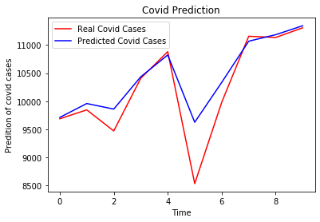
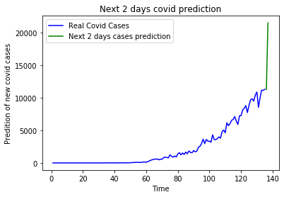

# Covid19-prediction-using-RNN
I have  developed a RNN model to predict the number of confirmed covid19 cases in India. 
<h1>AIM</h1>

The main idea behind this project was to predict the number of covid cases in India using time series analysis such as Recurrent 
Neural Network

<h1>DATA SET</h1>

I have used the dataset available on kaggle.

I then divided this dataset into training(125 columns) test(10 columns)

Then I used timesteps=20 to predict the future cases.The test_data will look back upto 20 days and then predict the value 
for the next day using these 20 values.

 rnn.py contains the enitre python code for prediction of no. of covid19 cases.

<h1>GRAPH BETWEEN THE REAL COVID CASES AND PREDICTED CASES</h1>

Graph between real and predict covid19 cases in India is as follows:

<h3>GRAPH FOR THE NEXT 2 DAYS PREDICTION</h3>

The next 2 days prediction is done using RNN and the graph for the same is as follows:

